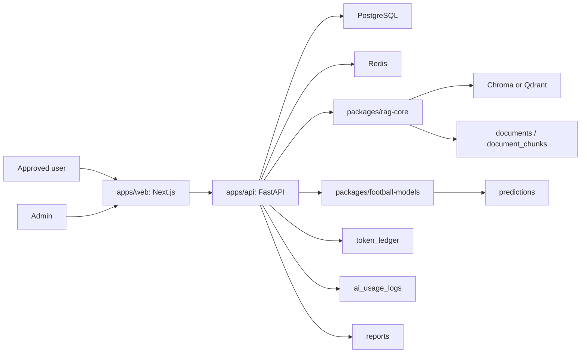

# Architecture Overview

## Project Identity

Project name: `worldcup-ai-prediction`

This project is a single-repository monorepo. All modules must live in the current Git repository. Do not create separate repositories, independent sibling projects, Git submodules, or nested Git repositories.

Required module locations:

```text
apps/web
apps/api
packages/shared
packages/rag-core
packages/football-models
docs
infra
```

## Product Goal

Build a World Cup AI/RAG football data prediction web system. The product is not a simple chatbot. It is a football data intelligence platform combining structured football data, RAG vector retrieval, statistical prediction models, admin-approved access, token quota metering, and AI-generated reports.

The product must avoid gambling, betting, odds recommendation, and guaranteed prediction wording. It may show probabilities, model assumptions, uncertainty, risk factors, citations, and data-driven analysis.

## Technology Direction

| Area | Direction |
| --- | --- |
| Frontend | Next.js / TypeScript |
| Backend | FastAPI |
| Database | PostgreSQL |
| Cache | Redis |
| Vector database | Chroma or Qdrant |
| RAG | Document ingestion, chunking, embedding, vector search, citation |
| Prediction engine | Elo, xG/xGA, Poisson, Monte Carlo, What-if |
| Access | Registration, admin approval, token quota |
| Payment | No Stripe, checkout, public recharge, or self-service paid plans in MVP |

## Runtime Modules



## Module Boundaries

### `apps/web`

Next.js / TypeScript frontend. It renders:

- Dashboard
- Match list and match detail
- Team detail and player detail
- Group simulator
- Knockout path simulator
- AI analyst sidebar
- Report center
- Account status and token balance
- Admin approval and token management screens

Frontend must depend on `docs/api/api-contract.md` for backend behavior. It must not infer database behavior or calculate authoritative token balances.

### `apps/api`

FastAPI backend. It owns:

- Authentication and registration
- Account approval checks
- Admin approval/token actions
- API contract implementation
- PostgreSQL persistence
- Redis caching
- Token ledger writes
- AI usage logs
- Calls into RAG and prediction packages

Protected AI/RAG/prediction/report APIs must require `approved` status and sufficient token balance.

### `packages/rag-core`

RAG library. It owns:

- Document ingestion
- Chunking
- Embedding
- Vector search
- Citation metadata

It must not own authentication, HTTP routing, token deduction, or admin actions.

### `packages/football-models`

Prediction library. It owns pure model functions:

- Elo
- xG/xGA feature handling
- Poisson score probability
- Monte Carlo simulation
- What-if scenario evaluation
- Player availability impact

It must not perform database reads, HTTP calls, or token ledger writes.

### `packages/shared`

Shared TypeScript/Python-neutral contract material where practical:

- API names and enums
- Shared validation rules
- Documentation-derived schemas
- Constants for account statuses and admin actions

### `infra`

Deployment and local infrastructure:

- Docker files
- PostgreSQL, Redis, and vector database service definitions
- Scripts for local bootstrap and verification

## MVP Access Model

MVP access uses admin approval and internal token quota:

1. User registers.
2. User starts as `pending_approval`.
3. Admin approves or rejects the user.
4. Admin grants initial token quota.
5. Approved users can call protected APIs.
6. Usage is metered after successful API calls.
7. Token balance is deducted through `token_ledger`.
8. Low token balance tells the user to contact admin.

No Stripe, checkout page, public recharge, subscription plan, or automatic paid upgrade exists in the MVP.

## Repository And Branch Rules

- This project must stay as one Git repository.
- Every board/module uses a feature branch inside this same repository.
- Codex may use a worktree only when it points to a branch of this same repository.
- Do not create multiple independent projects.
- Do not run `git init` inside subdirectories.
- Do not use Git submodules.
- Do not merge feature branches into `main` without human approval.
- Do not auto-archive tasks.

See [Branch Strategy](branch-strategy.md) and [Codex Branch Plan](codex-branch-plan.md).

## Source Of Truth Documents

- [Branch strategy](branch-strategy.md)
- [Codex branch plan](codex-branch-plan.md)
- [API contract](../api/api-contract.md)
- [Data model](../api/data-model.md)
- [Product scope](../product/product-scope.md)
- [Access token model](../product/access-token-model.md)
- [Acceptance criteria](../qa/acceptance-criteria.md)
